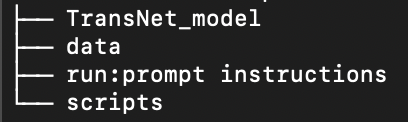

# AI_TADA-program-segmentation
## Introduction
This repository entails the work for the program segmentation part of the project "AI-TADA: Automated indexing of historical television data". A collaboration of Utrecht University and Beeld and Geluid institute (https://www.uu.nl/en/research/ai-labs/ai-media-lab/projects/ai-tada-automated-indexing-of-historical-television-data).

This repo is about the program segmentation. Specifically, it is aimed at segmenting programs from an input video stream.

The general flow of the project is:
1. Generate shot boundary detections (SBDs) from a video stream.
2. Segment the input video into shot videos, based on the SBD files.
3. Extract keyframes for each shot video.  (optional)
4. Calculate features of each (key)frame.
5. Use LDA/fisher score to maximize between-class variance as to distinguish program boundaries.

## Installation
1. Create anaconda environment with Python 3.11.5:
```
conda create --name AI_TADA python=3.11.5
```
2. Activate environment:
```
conda activate AI_TADA
```
3. Clone AI-TADA directory:
```
git clone https://github.com/ivarfresh/AI_TADA-program-segmentation.git
```

4. Go to directory:
```
cd {root_directory}/AI_TADA-program-segmentation
```
5. Install requirements.txt  (does not include packages required for TransNetV2):
```
pip install -r requirements.txt
```
7. Install the TransNetV2 model for SBD. Follow these steps: 
```
https://github.com/soCzech/TransNetV2/tree/master/inference
```
After installation, your root folder should look like this:

## Usage
